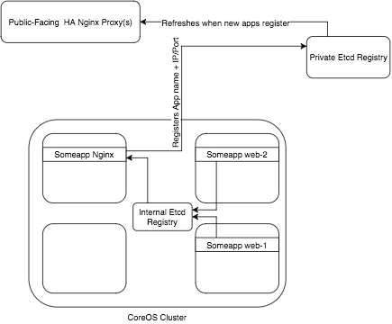
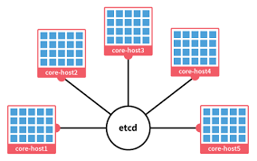

# docker
High Availability Docker DevOps with CoreOS, Etcd, Fleet, Flannel & Nginx

## Tools used:
- `coreos`: server machine clustering via a shared cloud-config.yml
- `etcd`: key value store for service registration and discovery
- `fleet`: scheduling/failover of docker containers across coreos cluster
- `flannel`: Gives each docker container a unique ip that allows you to access the internal port (i.e. port 80 not 32679)
- `confd`: watch etcd for nodes arriving/leaving - template nginx configuration files / reload nginx on change

### CoreOS
In my previous project on Docker [docker](https://github.com/Mr-Perfection/docker), I have used Ubuntu with Docker image but this time I will be using [CoreOS](https://coreos.com/).

### References
LearnCode.academy
